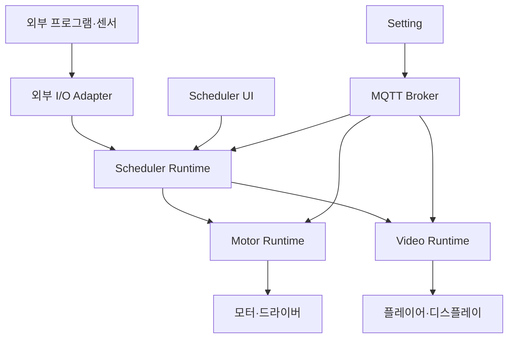

# Fusion 신규 개발 설계 기준 v1.0

작성일: 2026-09-14  
용도: Claude Code / Codex 개발 인계 및 구현 기준  
상태: 대화에서 합의한 방향을 통합한 신규 개발 명세. 실제 코드·장비 검증 결과가 아니다.

개정 사항: Fusion LED는 사용자 기능 구상 중으로 개발 보류한다. 현재 개발 대상은 Scheduler / Motor / Video / Setting이다. LED 재개는 사용자가 요구사항을 정한 뒤 별도로 결정한다.

## 1. 개발 전제와 문서 우선순위

Fusion을 새 프로젝트로 처음부터 개발한다. 기존 코드에 이어 붙이거나 기존 프로젝트를 리팩터링·마이그레이션하지 않는다. 기존 파일·저장소를 삭제하거나 덮어쓰지 않고 별도 신규 프로젝트에서 시작한다.

이 문서를 신규 개발의 단일 기준으로 사용한다. 이전의 「Fusion 아키텍처 검토 및 v0.1 구현 기준」과 「Fusion 통신 구조 및 프로토콜 설계 원칙」은 배경 자료다. 충돌 시 이 문서를 우선하며, 이전 문서에만 있는 기능을 자동으로 구현 범위에 추가하지 않는다.

문서 버전 v1.0은 설계 문서 버전이며, 첫 소프트웨어 릴리스의 기능 완성을 뜻하지 않는다. 첫 구현은 아래 19절의 1–2단계부터 시작한다.

## 2. 제품 목적과 기술 기준

Fusion은 미디어아트·설치 프로젝트의 상위 실행 순서를 제어하는 Show Control 시스템이다. Timeline과 State Machine으로 모터·영상·외부 프로그램의 동작을 조합한다. 모터의 저수준 제어 루프와 영상 디코딩 등은 장비 드라이버·전용 실행 엔진이 담당한다.

| 항목 | 기준 |
|---|---|
| 초기 플랫폼 | Windows x64 |
| 개발 | Python + uv |
| 데스크톱 UI | PySide6 |
| 실행 Core | Qt에 의존하지 않는 Python, Runtime별 asyncio loop |
| 앱 구조 | Scheduler / Motor / Video / Setting 독립 실행. LED 보류 |
| 앱 간 요청·조회 | HTTP/JSON API |
| 앱 간 상태·Event 구독 | WebSocket |
| 원격 설정·CS | MQTT, 대용량 파일은 HTTPS |
| 외부 연동 | OSC / UDP / TCP / Serial / MIDI 등 실제 요구에 따라 |
| 최종 배포 목표 | Python·uv 설치가 필요 없는 Windows 실행파일/설치파일 |
| 지금 제외 | EXE 빌드·Installer 구현. 향후 패키징 가능한 구조만 유지 |

앱 간 HTTP/JSON과 WebSocket은 TCP 기반으로 사용한다. 자체 Raw TCP 메시지 프로토콜을 별도로 중복 구현하지 않는다. 사용자는 Fusion 내부 통신에서 TCP/UDP/OSC를 선택하지 않는다.

## 3. 전체 구성과 책임



위 그림의 앱 간 제어 경로는 HTTP/JSON 요청과 WebSocket 구독으로 구성한다. 화살표는 주요 책임 흐름이며 실제 연결은 응답과 상태 전달을 포함한다.

| 구성 | 소유하는 책임 |
|---|---|
| Scheduler Runtime | Show Controller, Timeline/Cue, State Machine, 조건 평가, 원격 명령 추적, 전체 Show 진행 |
| Motor Runtime | Target Registry, 장비별 Action 검증, Target Runner, 공유 I/O Session, 장비 상태, 정지·완료 판정 |
| Video Runtime | 미디어 준비·재생·종료, 플레이어 수명, 출력 매핑, 영상 상태 |
| Setting | 설정 편집·조회·전송, 배포 작업 추적, 적용 요청, 진단 표시 |
| 각 UI | Runtime에 요청하고 snapshot/Event를 표시 |

Scheduler는 장비 앱을 호출한다. 장비 플러그인이나 장비 포트를 직접 소유하지 않는다. 예외는 Scheduler에 명시적으로 구성한 외부 범용 I/O Endpoint이며, 이 Endpoint도 자신의 연결을 단독 소유한다.

Motor·Video는 Scheduler 없이도 자신의 UI/API로 수동 운영할 수 있다. 전체 Show는 Scheduler가 담당한다. Setting이나 MQTT Broker가 중단되어도 이미 적용된 로컬 구성과 현장 앱 간 제어는 계속 동작할 수 있어야 한다.

## 4. Runtime과 UI의 경계

Scheduler·Motor·Video는 각각 Headless Runtime을 갖고, UI는 별도 프로세스로 접속한다. 제품 이름과 프로세스 이름은 구분한다. 하나의 Launcher나 EXE 실행 모드로 UI와 Runtime을 시작해도 된다.

- UI 창 닫기는 Runtime 종료가 아니다. Runtime 종료는 별도 명시적 작업이다.
- 설치된 모든 앱을 항상 실행하지 않는다. 프로젝트에 필요한 Runtime만 실행한다.
- Core, contracts, Plugin API에서 PySide6/QObject를 import하지 않는다.
- Runtime 내부 명령은 명시적 함수·비동기 API로 제출한다.
- Runtime 내부 Event Bus는 이미 발생한 사실과 상태 변경을 알린다.
- Qt Signal/Slot은 UI 내부와 UI 측 통신 결과 반영에 사용한다.
- 네트워크·MQTT·장비 콜백은 검증된 입력을 Runtime loop로 전달한다. 콜백 스레드가 상태를 직접 변경하지 않는다.
- UI 프로세스가 종료되어도 Runtime이나 플레이어가 함께 강제 종료되지 않도록 수명을 관리한다.
- 초기 Windows Runtime은 사용자 세션에서 운영한다. 특히 화면 출력 조건을 확인하기 전 Windows Service로 일괄 전환하지 않는다.

State Machine은 TCP, HTTP, MQTT, OSC를 직접 다루지 않는다. 통신 계층이 입력을 내부 Command/Event로 변환한다.

## 5. 상태와 실행 권한

장비 앱은 자기 장비 상태의 원본을 소유한다. Scheduler의 장비 상태는 수신한 관측의 복사본이다. Scheduler가 move를 요청했다고 실제 위치를 목표 위치로 바꾸지 않는다.

| 데이터 | 소유자 |
|---|---|
| Show 상태, 현재 Cue, State Machine 상태 | Scheduler |
| 모터 위치·알람·이동 완료 | Motor |
| 현재 미디어·재생 상태 | Video |
| 적용된 설정 revision | 각 Runtime |
| 원격 설정 draft·배포 진행 표시 | Setting |

각 Runtime의 상태 변경은 자신의 asyncio loop에서 직렬화한다. 분리된 앱 전체에 하나의 전역 writer가 존재한다고 가정하지 않는다.

각 장비 Runtime에는 활성 제어 세션을 하나만 허용한다. 기본 모드는 MANUAL / SHOW / MAINTENANCE다.

- Show 시작 전 Scheduler가 필요한 장비 앱의 제어 세션을 확보한다. 일부 확보 실패 시 확보분을 해제하고 시작하지 않는다.
- SHOW 모드에서는 충돌하는 수동 이동·재생 요청을 거절한다.
- 인증·권한 검사를 통과한 정지 요청은 별도 제어 경로로 허용한다.
- 설정 적용과 연결/ID 변경은 해당 실행·제어 상태에서 허용되는지 장비 앱이 최종 검사한다.
- 제어 세션은 장비 앱이 발급한다. 갱신·만료는 장비 앱의 로컬 monotonic 시간으로 판단한다.
- 재시작하거나 제어권이 바뀌면 이전 세션 토큰을 무효화한다. 늦게 도착한 이전 세션 명령을 거절한다.
- 독립 운영 중인 앱에 Setting이 직접 적용할 때도 같은 권한·상태 검사를 거친다.

세션 만료 시간과 heartbeat 주기는 설정 가능한 값으로 두고 현장 요구로 확정한다. 고정 예시 숫자를 물리 정지 보장으로 사용하지 않는다.

## 6. 앱 간 통신과 API

Motor·Video Runtime은 API 서버와 WebSocket endpoint를 제공하고 Scheduler가 접속한다. 각 UI는 해당 Runtime에 접속한다. Scheduler도 자신의 Show 관리 API를 제공한다.

| 작업 | 예시 API |
|---|---|
| 앱 식별·버전 | GET /api/v1/info |
| Target·Action 설명 | GET /api/v1/targets |
| 현재 상태와 sequence | GET /api/v1/snapshot |
| 명령 접수 | POST /api/v1/commands |
| 명령 진행·결과 조회 | GET /api/v1/commands/{command_id} |
| Event 구독 | /api/v1/events — WebSocket |
| 제어 세션 확보·갱신·해제 | /api/v1/control-sessions 아래 명시적 작업 |
| 설정 Stage·Validate·Apply·조회 | /api/v1/config 아래 명시적 작업 |
| Show 시작·중단·조회 | Scheduler의 /api/v1/shows 아래 명시적 작업 |

위 경로는 구현 기준 초안이다. 실제 구현에서 요청·응답 모델과 오류를 OpenAPI 또는 동등한 명세로 고정한다. API v1 안에서 호환성이 깨지는 변경을 조용히 하지 않는다.

- 명령은 POST로 제출하고 접수 시 HTTP 202와 command_id를 반환한다. 202는 장비 실행 성공이 아니다.
- 잘못된 인수, 충돌, 권한 부족은 명시적으로 거절한다. 구조화 오류 code와 상세 원인을 제공한다.
- 앱 식별자는 runtime_id, 기동 식별자는 runtime_boot_id다. IP·표시 이름을 ID로 사용하지 않는다.
- 동일 PC는 loopback, 여러 PC는 구성한 LAN 주소를 사용한다. 주소 변경 외에도 bind·방화벽·인증 설정이 필요하다.
- 초기 loopback API도 인증을 사용한다. LAN 노출은 명시적으로 활성화하고 HTTPS/WSS와 인증·권한을 적용한다.
- 내부 설정 화면에는 앱 주소·연결 상태를 제공하되 transport 선택을 요구하지 않는다.
- 요청 크기, 응답 크기, WebSocket 메시지·구독 버퍼·대기열 크기에 상한을 둔다.
- 상태 전송량이 정지·명령 처리 루프를 막지 않게 한다. 고빈도 관측은 합칠 수 있으나 중요 Event는 조용히 버리지 않는다.
- HTTP 연결을 재사용하고 I/O는 비동기로 처리한다. 프레임마다 새 HTTP 연결을 만드는 구조는 금지한다.

## 7. Command 계약과 결과

모든 실행·설정 변경 요청에는 request_id를 부여한다. 명령을 실행하는 Runtime이 command_id를 발급하며, Scheduler는 자신의 Cue와 원격 command_id의 대응을 보관한다. 재전송이 필요하더라도 같은 논리 요청은 같은 request_id를 유지한다.

| 필드 | 의미 |
|---|---|
| protocol_version | Fusion 메시지 계약 버전 |
| request_id | 발신 요청 식별·중복 제거 |
| runtime_id / runtime_boot_id | 의도한 수신 Runtime과 기동 식별 |
| control_session_id | 장비 앱이 발급한 유효 제어권 |
| run_id / cue_id | Show 및 Cue 출처. 수동 요청은 없을 수 있음 |
| show_generation | Scheduler 실행 세대. run/세션과 함께 해석 |
| expected_config_revision | 수신 앱에 기대하는 설정 버전 |
| target_id / action / params | 대상·등록된 기능·인수 |
| completion_requirement | dispatched / acknowledged / observed |
| source / actor | 요청 경로·주체 |

수신 Runtime은 접수한 명령에 자기 execution_generation을 기록한다. 정지·Apply 시 이 값을 바꾸고 큐에서 꺼낼 때와 실제 I/O 직전에 확인한다. 앱별 generation 숫자를 전역 공통 카운터로 비교하지 않는다.

예시 인수 position=500과 단위는 가상 값이다. 실제 단위·범위는 Plugin schema와 설치 설정에서 정한다.

```json
{
  "protocol_version": 1,
  "request_id": "req-example-001",
  "runtime_id": "motor-stage-a",
  "runtime_boot_id": "boot-example-a",
  "control_session_id": "session-example-a",
  "run_id": "show-example-001",
  "cue_id": "cue-move-01",
  "show_generation": 1,
  "expected_config_revision": "motor-config-12",
  "target_id": "motor01",
  "action": "move",
  "params": {"position": 500},
  "completion_requirement": "observed",
  "source": "timeline"
}
```

진행 단계는 QUEUED → DISPATCHING → DISPATCHED → ACKNOWLEDGED → OBSERVING → TERMINAL을 기준으로 하되 장비가 지원하지 않는 단계를 만들어내지 않는다.

최종 결과는 SUCCEEDED / FAILED / CANCELLED / EXPIRED / REJECTED / UNKNOWN이다. SUCCEEDED에는 achieved_completion을 기록한다.

- API accepted: Fusion 앱이 검증·접수했다.
- DISPATCHED: 로컬 전송 경로로 장비 명령을 보냈다.
- ACKNOWLEDGED: 장비/대상 프로그램의 계약상 수락을 확인했다.
- observed 성공: 해당 명령의 물리적·의미적 완료 조건을 관측했다.

같은 request_id와 같은 내용은 기존 command_id·결과를 반환한다. 같은 ID의 다른 내용은 충돌이다. 중복 판정은 인증된 발신 주체와 수신 Runtime 범위에서 정의한다. 변경 요청 접수·결과는 로컬 영속 기록으로 관리한다.

응답 유실로 실행 여부를 모르면 UNKNOWN이다. 자동 모션 재실행은 기본 금지한다. 저장소 기록과 물리 동작을 하나의 트랜잭션처럼 취급하지 않는다. 재시작 후 미완료 명령을 재생하지 않고, 관측 및 명시적 복구 절차를 수행한다.

큐 대기 기한·통신 응답 timeout·물리 동작 timeout을 구분한다. PC 간 monotonic 값을 비교하지 않는다. 초기 Show는 Scheduler가 제출 기한을 관리하고, 수신 앱은 로컬 접수 후 대기 기한과 제어 세션 유효성을 관리한다. 엄격한 PC 간 송신~실행 기한 보장은 별도 시계·기한 프로토콜 없이는 제공하지 않는다.

## 8. Event·상태·재접속

Event는 발생한 사실이며, Command는 실행 요청이다. 동작 완료 Event에는 해당 command_id를 반드시 연결한다. 일반 센서 Event에는 command_id가 없을 수 있다.

Event 공통 필드: event_id, type, runtime_id, runtime_boot_id, sequence, target_id, payload. 명령 관련 Event에는 command_id, run_id, cue_id, show_generation, 실행 시 config revision을 포함한다.

```json
{
  "type": "command.completed",
  "event_id": "event-example-42",
  "runtime_id": "motor-stage-a",
  "runtime_boot_id": "boot-example-a",
  "sequence": 42,
  "command_id": "cmd-example-001",
  "run_id": "show-example-001",
  "cue_id": "cue-move-01",
  "show_generation": 1,
  "target_id": "motor01",
  "payload": {"outcome": "SUCCEEDED", "achieved_completion": "observed"}
}
```

State Machine은 현재 기다리는 command_id·run·generation과 일치하는 완료만 처리한다. 이전 명령의 늦은 완료로 다음 상태를 진행하지 않는다.

재접속 절차:

1. Runtime 식별·boot ID·프로토콜 호환성을 확인한다.
2. snapshot과 그 snapshot에 대응하는 sequence를 받는다.
3. 해당 sequence 이후 Event를 구독·재생한다. 서버는 제한된 replay buffer를 제공한다.
4. snapshot 조회와 구독 사이 발생한 Event도 replay로 회수한다. buffer 범위를 벗어나면 resync_required를 반환한다.
5. 진행 중 명령은 command_id로 결과를 재조회한다. 같은 Event 중복 수신은 한 번만 처리한다.
6. 복원 불가능한 중요 Event 누락·명령 상태 불명은 Show를 오류/중지 상태로 전환한다. 자동으로 건너뛰거나 재실행하지 않는다.

snapshot은 현재 상태를 복원하며 과거의 모든 버튼 입력·펄스·완료 사건을 복원하지 않는다. heartbeat는 위치 관측의 신선도를 갱신하지 않는다.

상태는 connection / health / activity / observation quality를 분리한다. position·homed·alarm 등 필드마다 관측 시각, 유효시간, 단위, quality를 둔다. desired와 observed를 구분한다. 알 수 없는 값을 0·false·READY로 치환하지 않는다.

## 9. Plugin·Target·I/O Session

모터 제조사의 함수 이름과 고유 기능은 유지한다. 공통화 대상은 호출·검증·결과·상태·정지 capability 계약이다.

- Plugin은 manifest와 명시적인 공개 Action registry를 제공한다.
- manifest에 plugin_id, plugin_version, plugin_api_version, config schema, actions, state schema, capabilities를 선언한다.
- Action에는 params schema, 단위, 범위, 허용 모드, 충돌 자원, 완료 수준, retry/busy 정책을 선언한다.
- 원격 action 문자열로 임의 getattr·Python·shell 실행을 하지 않는다.
- 시작 시 manifest와 실제 등록 Action의 일치를 검사한다.
- import 시 장비 연결·스레드 시작을 하지 않는다. 실제 사용하는 Target만 생성한다.
- 설치 검증된 외부 plugins/ 경로를 유지한다. Project 업로드로 Plugin 코드를 설치하지 않는다.
- 초기 hot reload·Plugin별 가상환경·Marketplace·자동 코드 업데이트는 제외한다.
- stop_motion capability와 실제 장비의 정지 한계를 명시한다.

Target은 논리 축·장치이며 connection_id는 실제 연결 자원이다. 하나의 RS485 버스나 공유 드라이버 연결은 Session 하나가 단독 소유한다. 서로 다른 앱에서 같은 COM 포트·SDK 연결을 동시에 열지 않는다.

Dispatcher → Target Runner → Plugin → I/O Session 경로로 실행한다. Target 충돌 실행과 공유 Session 요청/응답을 각각 조정한다. 모터가 이동을 마칠 때까지 통신 버스 잠금을 유지하지 않는다. 이동 중에도 허용된 조회·정지 트랜잭션을 처리할 수 있어야 한다.

RS485는 물리 인터페이스이며 Modbus RTU 등 실제 프로토콜을 구분한다. 기존 라이브러리 client를 Session으로 감싸고 같은 포트를 별도 serial 객체로 중복 개방하지 않는다.

블로킹 serial은 제한된 전용 worker로 처리한다. 제조사 DLL의 crash/hang 위험은 필요 시 별도 worker 프로세스로 격리한다. worker를 종료했다고 물리 모터가 멈췄다고 간주하지 않는다.

## 10. 큐·정지·연결 상실

모든 Queue·buffer·task는 소유자와 상한을 갖는다. 명령 overflow는 명시적으로 거절한다. 무제한 create_task, 무제한 Poll 누적, 무제한 로그 append를 금지한다.

- 우선순위는 STOP/CONTROL, NORMAL, POLL 정도로 제한한다.
- 일반 모션 busy 기본값은 reject다. 큐잉을 허용하면 기한을 둔다.
- 상대 이동·home·toggle·pulse 자동 재시도는 금지한다. 읽기 등 검증된 Action만 제한 재시도한다.
- 재시도 소유자는 하나다. 하위 라이브러리와 상위 계층의 재시도가 곱해지지 않게 한다.
- 출력 게이트를 닫고 execution_generation을 변경한 뒤 미송신 명령을 무효화한다.
- STOP은 활성 모션 완료를 기다리는 큐 뒤에 묶지 않는다. 이미 송신한 패킷은 회수할 수 없다.
- Runtime crash·Scheduler 연결 상실은 장비 정지 증거가 아니다.

장비 앱이 제어 세션 만료를 감지하면 새 제어 명령을 차단하고 설치별 loss/stop profile을 수행한다. 예: 검증된 감속 정지, 제한된 현재 동작 완료, 영상 정지 또는 재생 유지. 실제 프로파일은 장비·기구별로 확인하며, 실장비 arm 전에 필수 설정으로 검증한다.

Scheduler는 필수 앱의 연결·제어권 상실 시 새 Cue를 차단하고 도달 가능한 앱에 중단을 요청한다. 재연결만으로 Show를 자동 재개하지 않는다. 소프트웨어 정지는 독립된 장비 보호·비상정지를 대체하지 않는다.

## 11. Scheduler / Timeline / State Machine

초기에는 활성 Show 하나, Timeline 하나, 명시적인 단순 상태 전이부터 구현한다. Timeline은 시간에 따른 Cue를 제출하고 State Machine은 Event·조건으로 전이 및 Action을 요청한다. 두 경로 모두 같은 명령 제출·충돌 정책을 사용한다.

- Show 상태: IDLE / PREPARING / ARMED / RUNNING / HOLDING / STOPPING / FAULTED.
- Show 시작 전 필수 앱·Target·설정 조합·제어권·신선한 상태를 검증한다.
- Cue는 cue_id, at_ms, 대상 runtime/target, action, params, 완료 요구, dependency, 지각·오류 정책을 가진다.
- Timeline은 로컬 monotonic 시작 기준으로 예정 시각을 계산한다. 반복 sleep 오차를 누적하지 않는다.
- dependency cycle·누락·미지원 완료 수준은 검증 오류다.
- 고정 시각 Cue가 늦으면 실행 허용 범위/skip/abort 정책을 적용한다. 지난 Cue를 몰아서 실행하지 않는다.
- 첫 단계의 Trigger는 등록된 source/type/간단 비교/show 상태로 제한한다. eval·임의 스크립트는 제외한다.
- 버튼 debounce, 아날로그 hysteresis/cooldown, 시작 연타 재진입 방지, 전이 반복 제한을 제공한다.
- State Machine의 대기 상태에는 timeout·오류 전이를 명시한다.
- HOLD는 Show 시계와 신규 Cue 제출을 멈춘다. 이미 장비 앱에 접수된 동작은 자동 pause된다고 약속하지 않는다. 초기에는 장비 앱에 미래 Cue를 대량 예약하지 않는다.
- 기본 운영은 Abort 후 재준비·Restart다. 모든 장비의 통합 Pause/Resume은 후속 범위다.
- 실장비 Timeline scrub/seek에 따른 과거 Cue 재실행은 금지한다. 편집 미리보기는 simulation으로 수행한다.
- 명령 송신 시각과 실제 동작 시작·완료 시각을 구분한다. 다중 PC 프레임 동기와 하드 실시간은 초기 보장 범위가 아니다.

## 12. Video / LED 범위

Video 초기 목표는 출력 하나의 prepare/play/pause/stop/seek/loop/volume과 상태·종료 Event다. mpv 등의 외부 플레이어를 Adapter로 관리한다. Player는 UI 수명에 종속시키지 않는다.

- prepare는 파일 존재뿐 아니라 선택한 backend의 실제 로딩·준비 조건을 확인한다.
- play 명령의 성공과 playback.ended는 구분한다.
- media_generation으로 이전 영상의 늦은 Event를 배제한다.
- 실제 패널 첫 프레임 표시·시작 지연은 측정 대상이다.
- 초기 seamless 전환·다중 출력 frame lock·전용 영상 편집기는 제외한다.

### Fusion LED — 개발 보류

사용자가 필요한 기능을 구상 중이므로 Fusion LED의 기능·범위·개발 일정은 확정하지 않는다. 앞서 제안했던 소규모 Art-Net 출력·기본 효과·30Hz 등의 LED 구현 기준도 현재 요구사항에서 제외한다.

- 이번 개발에서는 LED Runtime, UI, 출력 엔진, 효과, 픽셀 매핑, LED 전용 Plugin·API·설정 schema·시험을 구현하지 않는다.
- 빈 led/ 폴더나 LED 전용 placeholder 클래스를 미리 만들지 않는다.
- Scheduler 시작, 필수 앱 검사, 설정 배포, 통합 시험 및 완료 기준에 LED를 포함하지 않는다. LED가 없어도 현재 범위가 완성되어야 한다.
- 공통 Runtime/API 계약은 새 앱을 추가할 수 있는 구조로 유지한다. 이를 위해 LED 전용 기능을 선행 구현하지 않는다.
- 추후 사용자가 기능을 확정하면 별도 설계·개발 단계로 추가한다. 현재 단계가 끝났다는 이유만으로 자동 착수하지 않는다.
- 외부 프로그램 연동용 범용 OSC/UDP/TCP 기능은 유지한다. LED 전용 Art-Net 엔진을 범용 Endpoint라는 이름으로 대신 구현하지 않는다.

## 13. 외부 프로그램과 센서

외부 연동의 프로토콜 선택은 사용자에게 제공한다. Fusion 앱 간 통신 선택과는 별개다.

| 외부 경로 | 기준 |
|---|---|
| OSC | 주소·인수와 외부 Action/Event 매핑 |
| Raw UDP | datagram payload·입력 파서. 송신 성공과 수신 확인 구분 |
| Raw TCP/Serial | framing·최대 길이·수신 timeout을 명시 |
| Modbus | 장비 Plugin과 공유 Session으로 의미 해석 |
| MIDI | 실제 첫 장비/프로그램 요구 시 추가 |
| BLE/RFCOMM | 첫 장비 요구 전 구현 제외 |

외부 입력도 직접 장비 함수를 호출하지 않고 등록된 Trigger/Command 경로로 들어온다. 외부 상태 Event가 Fusion 명령 완료를 의미하려면 명시적인 응답·상관관계 계약이 있어야 한다.

## 14. 설정 데이터와 MQTT

설정 데이터는 다음처럼 분리한다.

| 데이터 | 관리 기준 |
|---|---|
| Show, Timeline, Trigger, 논리 Target | 프로젝트 revision |
| COM 포트, NIC, IP, 출력 모니터 | Runtime별 site binding revision |
| 방향, 교정, 축 제한, stop profile | 검증된 설치 설정 revision |
| 인증정보 | 로컬 secret store/reference. 일반 설정 Pull에 포함하지 않음 |
| 창 위치·테마 | UI preference |
| 현재 위치·관측값 | Runtime 상태. 설정으로 덮어쓰지 않음 |

MQTT는 원격 관리 경로다. 각 Runtime의 MQTT Adapter는 HTTP와 동일한 내부 검증·권한·설정 서비스를 호출한다. MQTT 전용 우회 Apply 경로를 만들지 않는다.

- 주요 기능: config push/pull, staged/active revision 조회, apply 요청·결과, 상태·진단.
- 작은 JSON 설정은 MQTT payload로 전달 가능하다. 대용량 패키지·영상·대량 로그는 HTTPS로 전송한다.
- broker가 파일 서버 역할을 한다고 가정하지 않는다. 파일 전송 endpoint/저장소는 배포 환경에서 별도로 구성한다.
- 실행·적용 요청은 retain=false이며 retained 실행 요청도 수신 시 거절한다.
- QoS 설정과 별개로 request_id 중복 제거·만료·제어 세션/boot 검사·결과 조회를 적용한다.
- 상태 retained는 허용하되 관측 시각·boot ID·신선도를 표시한다.
- 원격 요청 만료는 신뢰 가능한 시계 조건 또는 Runtime 발급 유효 세션으로 검증한다. 무기한 과거 요청 실행을 허용하지 않는다.
- TLS, Runtime별 topic ACL, 조회/제어/배포 권한을 분리한다.
- 초기 MQTT에서 직접 모터 이동·Show 실행은 구현하지 않는다. 필요 시 명시적인 후속 기능으로 추가한다.

## 15. 설정 배포와 여러 앱의 버전 일치

Upload → Validate → Stage → Apply → Arm → Start를 분리한다. 사용자는 한 번의 전송 작업으로 진행 상태를 볼 수 있지만, 업로드 완료가 즉시 장비 가동을 뜻하지 않는다.

1. 임시 위치에 수신하고 크기·hash·경로·schema·참조·Plugin 호환성을 검증한다.
2. 불변 revision으로 Stage한다. 실행 중에도 Stage는 허용한다.
3. Apply는 Show 정지·제어권·장비 상태 등 적용 조건을 검사한다. 실행 중이면 staged 상태로 두고 적용 불가 이유를 반환한다.
4. 초기 버전은 Show 종료 후 자동 Apply를 예약하지 않는다. 적용 가능 상태에서 명시적인 새 Apply 요청을 받는다.
5. 각 Runtime은 apply lock과 expected_active_revision으로 동시 적용·덮어쓰기를 방지한다.
6. 출력 게이트 차단, execution_generation 갱신, 구명령 무효화 후 새 구성을 적용한다.
7. 적용 journal과 active revision을 기록한다. 실패 시 사용 가능하다고 표시하지 않는다.
8. 적용 후 DISARMED로 남는다. Arm/Start는 별도다.

여러 앱 배포는 deployment_id 아래 Runtime별 staged/active revision과 결과를 기록한다. 프로젝트에는 필요한 Runtime별 구성 revision/hash 조합을 선언한다. 각 앱의 revision 숫자가 같아야 한다는 뜻은 아니다.

Show에 참여하는 Runtime의 적용은 Scheduler와 조정한다. Scheduler가 Show 정지 및 배포 잠금을 확인하고, 장비 앱도 유효한 배포 권한·로컬 상태를 검사한다. Setting의 MQTT 요청이 SHOW 제어권을 우회하지 못하게 한다. Scheduler에 연결할 수 없으면 참여 앱의 Stage는 가능하지만 그룹 Apply는 거절한다. 독립 운영 앱은 자신의 MAINTENANCE 상태에서 별도 적용할 수 있다.

일부 앱만 적용 성공하면 PARTIAL/FAILED로 표시하고 Show 시작을 차단한다. 후속 재적용이나 명시적 이전 구성 복원 후 전체 조합을 다시 확인한다. 분산 원자 적용·무중단 hot apply는 초기 범위가 아니다. 파일 롤백은 이미 발생한 물리 동작을 되돌리지 않는다.

## 16. 로그·모니터·진단

각 Runtime은 구조화 로그와 회전·보존 제한을 갖는다. UI를 열지 않아도 상태 관측과 필요한 기록은 동작한다.

필수 추적 정보: UTC, 로컬 monotonic offset, runtime_id, runtime_boot_id, run_id, cue_id, request_id, command_id, target_id, connection_id, config revision, generation, 단계, 오류, 소요시간.

LOG 화면은 명령 접수/송신, 장비 return, 명령 결과, Event, 오류를 연결해서 보여준다. 인증정보는 마스킹한다. Raw IO는 Session별 선택 활성화·시간/용량 제한을 둔다.

표시 항목은 실제/목표 상태, 관측 age, 연결·health·activity, 명령 단계, 큐 길이·대기시간, 응답 RTT, Scheduler 지각, 적용 버전, 연결 복구 상태다. 고빈도 로그를 묶어서 갱신하고 UI 행 수를 제한한다. 파일 기록을 제어 loop에서 동기 대기하지 않는다.

## 17. 코드 구성과 의존성

처음부터 하나의 신규 저장소에서 공유 계약과 앱별 실행점을 관리한다. 독립 실행이 곧 별도 저장소·별도 개발 환경을 뜻하지 않는다.

```text
fusion/
  pyproject.toml
  uv.lock
  src/fusion/
    contracts/       # Command, Event, State, API, Plugin 계약
    core/            # 공통 검증·명령 추적·상태·큐 구성 요소
    transport/       # HTTP 서버/클라이언트, WebSocket, MQTT Adapter
    io/              # 연결 Session, Serial/Modbus 등
    plugin_sdk/      # Plugin 계약·검증·로더
    apps/
      scheduler/
      motor/
      video/
      setting/
    ui/              # PySide6 화면 및 UI 전용 코드
    telemetry/
    simulation/
  plugins/           # 외부 설치 Plugin 경계
  tests/
  docs/
```

이 트리는 책임 경계다. 첫 단계에서 모든 빈 폴더·클래스를 생성하지 않는다. 필요한 실행 경로부터 구현한다. 공통 Core는 재사용되는 코드이며 전역 Runtime 상태 싱글턴이 아니다.

HTTP 서버·클라이언트, schema 검증, MQTT 등은 구현 시 Windows·선택한 Python 버전에서 호환성을 확인하고 한 가지씩 선정해 uv.lock으로 고정한다. 문서에 없는 제조사 API·레지스터·단위·제한값을 추측하지 않는다.

설치 폴더와 프로젝트·로그·캐시·site 설정 경로를 분리한다. 개발 경로에 하드코딩하지 않는다. 초기에는 uv run 기반 실행 방법을 제공하고 EXE·Installer는 만들지 않는다.

## 18. 검증 기준

| 시나리오 | 통과 조건 |
|---|---|
| 같은 요청 두 번 제출 | 동일 command_id, 실제 Action 한 번 |
| 같은 ID·다른 내용 | 충돌 오류 |
| accepted 응답 유실 | 결과 조회로 복구, 새 모션 자동 실행 없음 |
| 장비 ACK 유실 | UNKNOWN, 미실행으로 단정하지 않음 |
| 이전 완료 Event 지연 수신 | 현재 State Machine 진행에 영향 없음 |
| snapshot/구독 사이 Event 발생 | replay로 회수하거나 명시적 resync |
| 복구 불가능한 중요 Event 누락 | Show 오류·시작/진행 차단 |
| Scheduler 종료·제어 세션 만료 | 장비 앱이 신규 명령 차단·설정된 loss profile 수행 |
| 장비 Runtime 재시작 | 이전 boot/session 명령 거절, 자동 모션 이어하기 없음 |
| UI 종료·재접속 | Runtime 유지, 최신 상태 복구 |
| STOP 직전 일반 큐 대기 | 구세대 일반 출력 차단, 정지 결과 별도 표시 |
| 공유 버스 두 Target | 요청/응답 충돌 없음, 이동 중 조회·정지 가능 |
| Show 중 설정 Apply | 거절, Stage된 구성은 보존 |
| 일부 앱만 설정 적용 | 버전 조합 불일치 표시, Show 시작 차단 |
| 로그·관측 폭주 | 큐 상한 유지, 중요 명령·Event 정책 작동 |
| Broker 중단 | 현장 로컬 제어 지속, 원격 관리 장애 표시 |
| 장시간 운영 | 메모리·task·큐의 지속 증가 없음 |

먼저 Fake Motor·fake clock으로 결정적 실패 시험을 구현한다. 실제 통신 parser에는 부분 수신·잘못된 프레임·늦은 응답 시험을 적용한다. 실장비 검증 전 문서의 예시를 장비 사양으로 사용하지 않는다.

성능 보고는 기준 PC, 앱/축/Session 수, Poll 주기, Cue 밀도, 출력 조건을 명시하고 지각·RTT·정지 지연의 p95/p99/max를 기록한다. 첫 통합 안정화 후 24시간 시험을 수행하고 실제 운영 요구에 맞춰 기간을 확대한다.

## 19. 단계별 개발 순서

| 단계 | 구현 범위 | 완료 산출물 |
|---|---|---|
| 1 | 신규 프로젝트, 공통 계약, Headless Motor Runtime, Fake Motor, HTTP 명령·결과 API | UI 없이 이동 요청·결과·중복 제거 실행 |
| 2 | WebSocket Event, snapshot/replay, 세션·boot·generation, 최소 Headless Scheduler | Scheduler → Fake Motor → 완료 Event → 상태 전이, 실패 시험 |
| 3 | Motor/Scheduler 최소 UI, 로그·모니터, 단순 Timeline·Trigger | 수동·Show 제어권 분리, UI 종료/재접속 |
| 4 | 실제 Motor Plugin 한 종류와 공유 Session | 제조사 근거가 있는 이동·조회·정지·오류 검증 |
| 5 | Video Runtime, 출력 하나 | 준비·재생·종료와 Scheduler 연동 |
| 6 | 실제 프로젝트에 필요한 외부 Endpoint | 범용 송수신·입력 Event·Scheduler 연동. LED 전용 출력 제외 |
| 7 | Setting, MQTT 상태·설정, HTTPS 파일 전송, 그룹 배포 | Push/Pull/Stage/Apply/부분 실패·버전 조합 검증 |
| 8 | LAN 통합·장시간 운영·성능 측정 | 현장 시나리오 검증 보고 |

Fusion LED는 위 개발 순서 전체에서 제외하며, 사용자 요구사항 확정 후 별도 계획한다. 현재 범위에 필요한 앱의 UI와 프로토콜을 단계적으로 구현한다. 각 단계마다 작동 경로 하나를 완성하고 실행 방법·검증 결과·남은 한계를 보고한다. 실장비 정보가 없으면 Fake 단계는 진행하고 실제 출력만 보류한다.

## 20. 실제 장비 투입 전 필요한 정보

아래 정보는 신규 Core 개발을 막지 않는다. 실장비 설정·성능·출력 정책을 확정할 때 수집한다.

1. 첫 모터 모델, 매뉴얼/SDK, 연결 방식과 정지·완료 관측 방법.
2. 축·공유 버스·센서·화면 수 및 Poll 요구. LED/Universe 요구는 추후 LED 설계 시 수집한다.
3. 송신/물리 시작/완료 중 어떤 시간 오차를 제한할지와 허용값.
4. 연결 상실·비상정지·정전 복구 시 장비별 동작.
5. 영상 해상도·코덱·첫 프레임·전환 요구.
6. LAN/인터넷 관리 범위, Broker·파일 전송 서버 배치.

## 21. 개발 에이전트에 전달할 시작 지시

이 문서를 기준으로 Fusion을 별도 신규 프로젝트에서 처음부터 개발하라. 기존 코드에 이어서 작업하거나 마이그레이션하지 말고 기존 프로젝트를 삭제·변경하지 마라. Windows x64, Python + uv + PySide6를 기준으로 하되 Core는 Qt에 의존하지 않게 한다. 독립 Runtime 앱 사이에는 HTTP/JSON API와 WebSocket 구독을 사용하고, 내부 Command API와 Event Bus를 분리하라.

현재 전체 개발 범위는 Scheduler / Motor / Video / Setting이다. Fusion LED는 기능 구상 중으로 전 단계에서 보류하며 코드·UI·설정·시험·필수 앱 의존성을 추가하지 마라. 사용자가 별도 재개를 요청할 때까지 보류를 유지하라.

이번 첫 구현은 19절의 1–2단계로 제한하라. Headless Motor Runtime과 Fake Motor, 최소 Headless Scheduler를 실제로 실행하여 명령 제출 → 접수 → 실행 관측 → 완료 Event → 상태 전이 경로를 완성하라. request_id 중복 제거, UNKNOWN, 제어 세션, boot ID, 실행 세대, snapshot/replay, 재접속 결과 조회, 큐 상한과 연결 상실 처리도 함께 검증하라.

공개 Action은 명시적으로 등록하고 가상의 제조사 사양을 만들지 마라. UI·Video·LED·MQTT·설정 배포·EXE 빌드는 첫 단계에 구현하지 마라. 각 단계가 끝나면 변경 내용, 실행 명령, 수행한 시험과 결과, 남은 제한, 다음 단계 작업을 보고하라. 모든 기능의 빈 클래스를 대량 생성하지 말고 작동 경로를 우선 완성하라.

## 22. 기술 참고

아래 자료는 전송·동시성의 기술적 배경이다. Fusion의 역할 분담·API 경로·개발 단계는 이 프로젝트의 설계 결정이다. 실제 채택 라이브러리의 버전별 문서는 구현 시 확인한다.

- Python Socket HOWTO — 바이트 스트림, 메시지 경계와 부분 수신: https://docs.python.org/3/howto/sockets.html
- RFC 9293 — TCP: https://www.rfc-editor.org/rfc/rfc9293.html
- Qt Threads and QObjects — Signal/Slot과 스레드 경계: https://doc.qt.io/qt-6/threads-qobject.html
